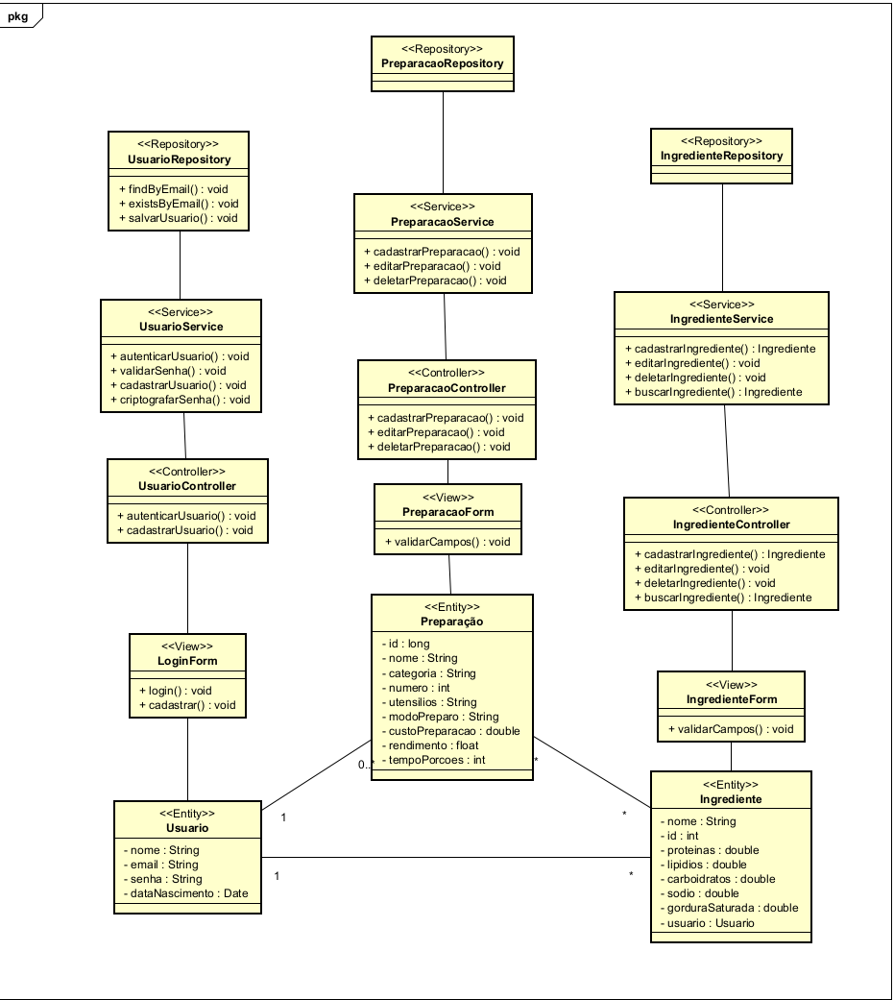
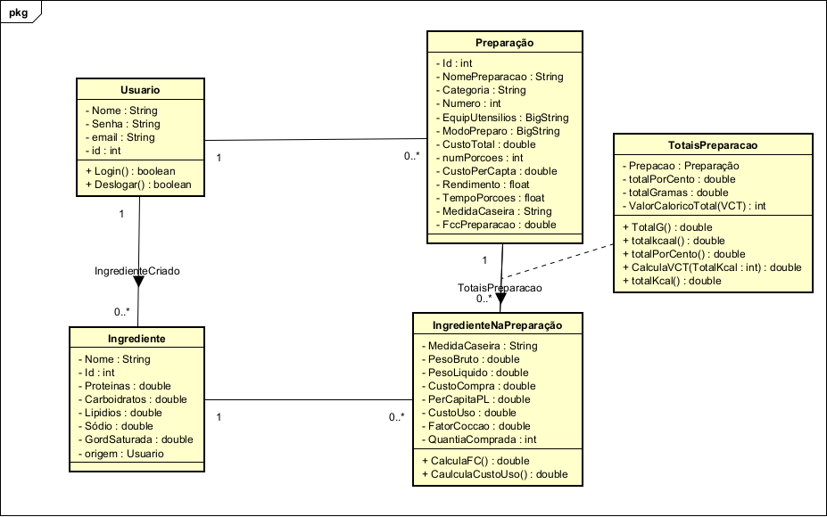
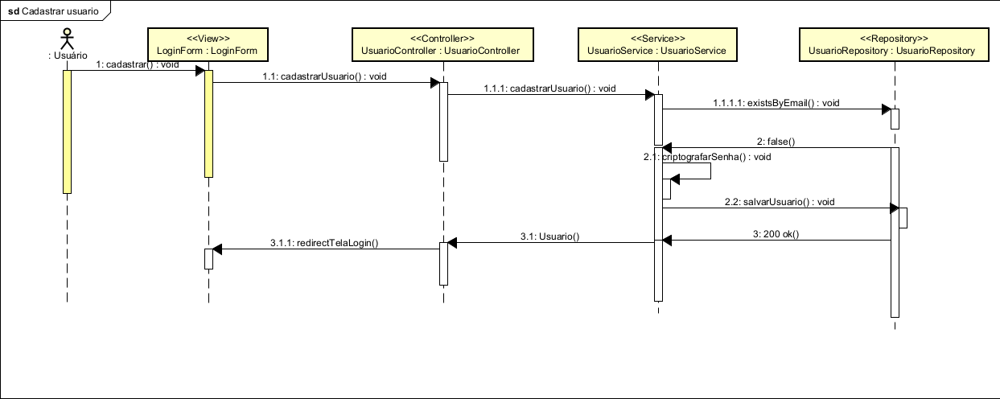
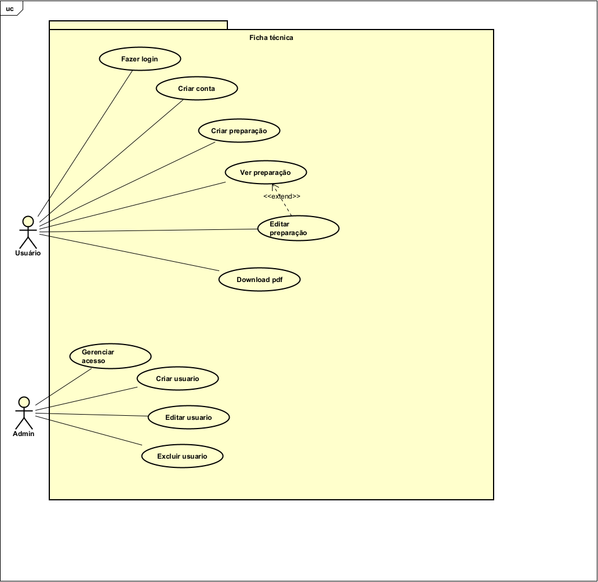

##  Diagramas

###  Diagrama de Classes

###  Modelo de Domínio

###  Diagramas de Sequência

#### Cadastrar Usuário

#### Login

###  Casos de Uso

---

## 📄 Documentação

- [ Descritivo de Casos de Uso (PDF)](diagramas/Descritivo.pdf)
- [ Documentação Anotada (PDF)](diagramas/Documentacao%20anotada.pdf)

